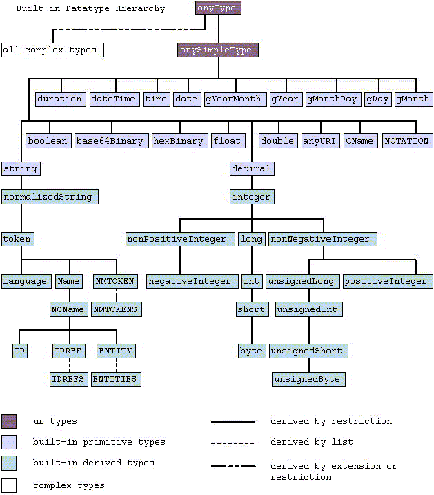
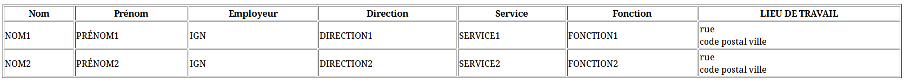

% Initiation à XML - partie II
% Véronique Lemaire, Didier Richard
% rèv. 2.3.1 du 11/01/2016

---


# Découverte d’XML #


## Fiche pédagogique ##

Cours en deux jours (4 fois 3 heures).
Ce cours constitue les 2 fois 3 dernières heures.

Notes de [cours](XML2-a-slides).


### Objectif ###

* Initiation à XML, sa syntaxe (1er jour) ;
* Initiation à XML Schema et XSL (2nd jour).


### Pré-requis ###

* Avoir suivi le premier jour de cours !


### Auteurs ###

© IGN 2009 - Véronique Lemaire - Département Informatique (ENSG)\
© IGN 2015 - Didier Richard - ValiLab (DRE)


---


## Schémas XML (XSD) ##

Cette partie est beaucoup plus complexe que les précédentes. Le lecteur doit
avoir quelques connaissances en programmation ...

### Pourquoi un modèle ? ###

La syntaxe des DTD est issue du langage SGML (*S*tandard *G*eneralized
*M*arkup *L*anguage), beaucoup plus compliqué et lourd que ne l'est le langage
XML.

Le XML langage universel doit permettre un ensemble cohérent d’applications
depuis la définition des modèles jusqu’à leur présentation en passant par leur
structuration … Pour des soucis d’homogénéité, il fallait développer un langage
de définition de documents basé sur XML.

La définition de schémas XML (*X*ML *S*chema *D*efinition en anglais ou
XSD[^xsd]) apporte une grande souplesse et une puissance inégalée dans la
définition des documents XML. La fonctionnalité la plus remarquable des
schémas XML est la prise en charge des types de données (contenu garanti et
validation plus efficace). Le XSD permet aussi un modèle plus exhaustif car
définissant les éléments et la structure, avec les occurrences, les contenus
mixtes, les groupes d’attributs …

Enfin, l'extensibilité des définitions des documents apportée par les schémas
XML, facilite l'échange, la fusion ou la réutilisation de données provenant
d'une ou plusieurs sources. Effectivement, à l'instar des documents XML, les
schémas XML pourront désormais se combiner en se fusionnant complètement ou
partiellement afin de créer un modèle de contenu composite. D'ailleurs,
plusieurs schémas peuvent être référencés à l'intérieur d'un unique document
XML et donc valider la structure et le contenu de ce dernier.

La génération dynamique de documents XML et du modèle de contenu associé,
devient alors beaucoup plus commode. Évidemment, cela demande une certaine
compatibilité entre les schémas susceptibles d'être combinés en passant par
une normalisation entre distributeurs des contenus ou en utilisant des XSD
« standards ».

Ce langage de schéma constitue donc une pièce essentielle dans la sphère XML,
assurant une évolutivité, un dynamisme et une souplesse que ne pouvait assumer
le langage de DTD.

### Généralités ###

Le schéma commence par un élément racine, `xsd:schema` est la racine de tout
XSD, il est caractérisé par des attributs qu’il faut renseigner :

* `attributeFormDefault` : permet de savoir si les attributs doivent être munis de
  l’espace de noms ou pas ;
* `blockDefault` : empêche par défaut l’utilisation de types dérivés dans des
éléments attendant un type de base- extension restriction substitution-;
* `elementFormDefault` : permet de savoir si les éléments doivent être munis de
l’espace de noms ou pas ;
* `finalDefault` empêche la dérivation de type par restriction, extension ou les
deux ;
* `id` précise un identificateur unique pour le schéma ;
* `targetNamespace` indique un namespace cible pour tout élément étranger au
schéma XML ;
* `version` indique un numéro de version du schéma ;
* `xml:lang` précise la langue dans laquelle est conçu le document.

Et bien sûr on peut définir la liste de namespaces utilisés avec `xmlns`.
Le préfixe de l'espace de noms des schémas est très souvent `xsd` ; la forme
`xs` est aussi utilisée :

```xml
<?xml version="1.0" encoding="utf-8"?>
<xsd:schema xmlns:monEN="http://www.ensg.eu/xml1-a"
            xmlns:xsd="http://www.w3.org/2001/XMLSchema"
            targetNamespace="http://www.ensg.eu/xml1-a"
            elementFormDefault="qualified"
            version="0.0.1">
...
</xsd:schema>
```

L'élément `include` permet d'inclure un schéma XML d'un même espace de noms dans
un autre schéma pour l'utiliser :

```xml
<xsd:include id="ID" schemaLocation="anyURI" />
```

L'élément `import` permet d'importer un schéma XML avec un espace de noms
différent dans un autre schéma pour l'utiliser :

```xml
<xsd:import id="ID" namespace="anyURI" schemaLocation="anyURI" />
```

L’élément `xsd:element` permet de définir un élément du document XML et d’y
associer des propriétés. Si on a un type simple (i.e. atomique et sans
attributs), la définition se fait simplement, si on souhaite un type simple
personnalisé on utilise la balise `<xsd:simpleType>` et si on souhaite un type
complexe on utlise la balise `<xsd:complexType>` et enfin si on veut un
groupe, on utilise la balise `<xsd:group>` !


Les attributs associés à `xsd:element` sont répertoriés dans le tableau suivant :

+------------------+-----------------------------------------------+
|Attributs         |Description                                    |
+==================+===============================================+
|abstract          |provoque l'abstraction (true) de l'élément XML,|
|                  |devant être remplacé par un autre élément      |
+------------------+-----------------------------------------------+
|block             |spécifie une valeur de blocage du type dans des|
|                  |éléments attendant le type de base             |
+------------------+-----------------------------------------------+
|default           |précise une valeur par défaut pour l'élément   |
+------------------+-----------------------------------------------+
|final             |empêche la dérivation de type par restriction, |
|                  |extension ou les deux                          |
+------------------+-----------------------------------------------+
|fixed             |empêche une dérivation par restriction du type |
|                  |de l'élément                                   |
+------------------+-----------------------------------------------+
|form              |indique si l'élément XML doit être ou non      |
|                  |qualifié par un espace de noms                 |
+------------------+-----------------------------------------------+
|id                |précise un identificateur unique pour l'élément|
+------------------+-----------------------------------------------+
|maxOccurs         |précise le nombre d'occurrences maximum de     |
|                  |l'élément. Par défaut, ce nombre est égal à 1  |
+------------------+-----------------------------------------------+
|minOccurs         |précise le nombre d'occurrences minimum de     |
|                  |l'élément. Par défaut, ce nombre est égal à 1  |
+------------------+-----------------------------------------------+
|name              |indique le nom de l'élément XML                |
+------------------+-----------------------------------------------+
|nillable          |signifie qu'un élément peut être valide (true) |
|                  |lorsqu'il est nul, s'il est porteur d'un       |
|                  |attribut qualifié d'espace de noms `xsd:nil`   |
+------------------+-----------------------------------------------+
|ref               |spécifie une référence à un autre élément de   |
|                  |schéma                                         |
+------------------+-----------------------------------------------+
|substitutionGroup |définit un élément pour lequel l'élément peut  |
|                  |se substituer                                  |
+------------------+-----------------------------------------------+
|type              |fournit le type de données accepté par         |
|                  |l'élément                                      |
+------------------+-----------------------------------------------+

#### Les types simples ####

Un type simple est une balise XML qui ne contient que du texte, donc pas
d’attribut. La notion « que du texte » est trompeuse dans le sens où ce texte
peut prendre plusieurs formes et recouvrir plusieurs types au sens
informatique du terme.

Il en existe une liste assez longue d’une quarantaine de possibilités parmi
lesquelles on pourra retenir `xsd:string`, `xsd:integer`, `xsd:decimal`,
`xsd:time`, `xsd:boolean`, `xsd:date` …



On peut donc couvrir la majorité des cas qu’on rencontrera pour les types
simples.

Il est également possible de dériver des types simples :

* en les restreignant ;
* en définissant un format à adopter ;
* en créant une énumération ;
* en créant une liste d’éléments d’un type donné.

##### La restriction de type simple #####

```xml
<xsd:simpleType name="monEntier">
    <xsd:restriction base="xsd:integer">
        <xsd:minInclusive value="10000"/>
        <xsd:maxInclusive value="99999"/>
    </xsd:restriction>
</xsd:simpleType>

<xsd:element name="entier" type="monEntier"/>
```

donnera par exemple :

```xml
<entier>10001</entier
```

##### Définition d’un format #####

```xml
<xsd:simpleType name="monFormat">
    <xsd:restriction base="xsd:string">
        <xsd:pattern value="\d{3}-[A-Z]{2}"/>
    </xsd:restriction>
</xsd:simpleType>

<xsd:element name="format" type="monFormat"/>
```

donnera par exemple :

```xml
<format>123-AA</format>
```

##### Enumération #####

```xml
<xsd:simpleType name="unDepartement">
    <xsd:restriction base="xsd:string">
        <xsd:enumeration value="Ain"/>
        <xsd:enumeration value="Aisne"/>
        <xsd:enumeration value="Allier"/>
        <!-– etc -->
    </xsd:restriction>
</xsd:simpleType>

<xsd:element name="departement" type="unDepartement"/>
```

donnera par exemple :

```xml
<departement>Seine-et-Marne</departement>
```

##### Liste #####

```xml
<xsd:simpleType name="listeDEntiers">
    <xsd:list itemType="monEntier"/>
</xsd:simpleType>

<xsd:element name="liste" type="listeDEntiers"/>
```

donnera par exemple :

```xml
<liste>10000 20001 99999</liste>
```

#### Les types complexes ####

Les types complexes sont définis de différentes manières :

* par une extension d’un type simple auquel on adjoint un attribut ;
* par une séquence, un choix ou une suite d’éléments simples ;
* par un groupe.

On peut les dériver à partir des types simples en y ajoutant simplement un
attribut par exemple de la manière suivante :

```xml
<xsd:complexType name="unPrix">
    <xsd:simpleContent>
        <xsd:extension base="xsd:decimal">
            <xsd:attribute name="monnaie" type="xsd:string"/>
        </xsd:extension>
    </xsd:simpleContent>
</xsd:complexType>

<xsd:element name="prix" type="unPrix"/>
```

donnera par exemple :

```xml
<prix monnaie="euro">42.0</prix>
```

On peut décider de réaliser une séquence d’éléments de types définis. Dans
l’exemple suivant, on voit comment faire référence à un élément
défini par ailleurs dans le XSD et comment on définit les attributs (déjà vu dans
l’exemple précédent) :

```xml
<xsd:element name="element_1" type="xsd:integer"/>
<xsd:element name="element_2" type="xsd:integer"/>
<xsd:element name="element_3" type="xsd:integer"/>
<xsd:complexType name="element_enfantType">
    <xsd:sequence>
        <xsd:element ref="element_1"/>
        <xsd:element ref="element_2"/>
        <xsd:element ref="element_3"/>
    </xsd:sequence>
    <xsd:attribute name="id" use="required">
        <xsd:simpleType>
            <xsd:restriction base="xsd:NMTOKEN">
                <xsd:enumeration value="01"/>
                <xsd:enumeration value="02"/>
            </xsd:restriction>
        </xsd:simpleType>
    </xsd:attribute>
</xsd:complexType>

<xsd:element name="entiers" type="element_enfantType"/>
```

donnera par exemple :

```xml
<entiers id="01">
    <element_1>42</element_1>
    <element_2>99</element_2>
    <element_3>0</element_3>
</entiers>
```

On peut indiquer qu’un élément prend au choix une structure ou une autre comme
dans l’exemple suivant :

```xml
<xsd:element name="element_choix_1" type="xsd:integer"/>
<xsd:element name="element_choix_2" type="xsd:integer"/>
<xsd:complexType name="element_enfantType">
    <xsd:choice> 
        <xsd:element ref="element_choix_1"/>
        <xsd:element ref="element_choix_2"/>
    </xsd:choice>
    <xsd:attribute name="id" use="required">
        <xsd:simpleType>
            <xsd:restriction base="xsd:NMTOKEN">
                <xsd:enumeration value="01"/>
                <xsd:enumeration value="02"/>
               </xsd:restriction>
         </xsd:simpleType>
    </xsd:attribute>
</xsd:complexType>

<xsd:element name="entiers" type="element_enfantType"/>
```

donnera par exemple :

```xml
<entiers id="01">
    <element_choix_1>42</element_choix_1>
</entiers>
<entiers id="02">
    <element_choix_2>99</element_choix_2>
</entiers>
```

On peut enfin décrire une suite d’éléments simples sans ordre obligatoire :

```xml
<xsd:complexType name="element_enfantType">
    <xsd:all minOccurs="0" maxOccurs="1">
        <xsd:element name="element_1" type="xsd:integer"/>
        <xsd:element name="element_2" type="xsd:integer"/>
        <xsd:element name="element_3" type="xsd:integer"/>
    </xsd:all>
    <xsd:attribute name="id" use="required">
        <xsd:simpleType>
            <xsd:restriction base="xsd:NMTOKEN">
                <xsd:enumeration value="01"/>
                <xsd:enumeration value="02"/>
               </xsd:restriction>
         </xsd:simpleType>
    </xsd:attribute>
</xsd:complexType>

<xsd:element name="entiers" type="element_enfantType"/>
```

donnera par exemple :

```xml
<entiers id="01">
    <element_2>99</element_2>
    <element_3>0</element_3>
</entiers>
<entiers id="02"/>
```

Enfin on peut définir via la balise `complexContent`, un type plus complexe
encore :

```xml
<xsd:complexType name="type_personne" block="restriction">
    <xsd:sequence>
        <xsd:element name="nom" type="xsd:string"/>
        <xsd:element name="prenom" type="xsd:string"/>
        <xsd:element name="adresse" type="xsd:string"/>
    </xsd:sequence>
</xsd:complexType>
<xsd:complexType name="type_francaise">
    <xsd:complexContent>
        <xsd:extension base="type_personne">
            <xsd:sequence>
                <xsd:element name="code_postal" type="xsd:positiveInteger"/>
                <xsd:element name="ville" type="xsd:string"/>
            </xsd:sequence>
        </xsd:extension>
    </xsd:complexContent>
</xsd:complexType>

<xsd:element name="personne" type="type_francaise"/>
```

donnera par exemple :

```xml
<personne>
    <nom>NOM</nom>
    <prenom>PRENOM</prenom>
    <adresse>ADRESSE</adresse>
    <code_postal>1</code_postal>
    <ville>VILLE</ville>
</personne>
```

#### Déclaration d'un schéma pour un XML ####

Plusieurs notions entrent en jeu pour lier un document XML et son schéma,
ainsi que les schémas nécessaires à la compréhension des données.

Tout d'abord, le schéma qui décrit la structure des données appartient à un
espace de nommage qu'il convient de déclarer :

```xml
<monEspace:baliseRacine
    xmlns:monEspace="URIduSchema"
>
</monEspace:baliseRacine>
```

Il est possible aussi d'indiquer que cet espace de nommage est celui par
défaut pour éviter d'avoir à préfixer toutes les balises dans le document :

```xml
<baliseRacine
    xmlns="URIduSchema"
    xmlns:monEspace="URIduSchema"
>
</baliseRacine>
```

À l'instar des DTD où il est nécessaire d'indiquer si elle est locale
(`SYSTEM`) ou externe (`PUBLIC`), il est conseiller d'indiquer où se trouve le
schéma du document XML via l'un des attribut `xsi:noNamespaceSchemaLocation`
quand le schéma est local ou `xsi:schemaLocation` s'il est externe. Ce
faisant, on introduit un nouvel espace de nommage qu'il convient de définir :

```xml
<baliseRacine
    xmlns="URIduSchema"
    xmlns:monEspace="URIduSchema"
    xmlns:xsi="http://www.w3.org/2001/XMLSchema-instance"
>
</baliseRacine>
```

On utilise ensuite l'un des attributs `xsi:noNamespaceSchemaLocation` ou
`xsi:schemaLocation` pour lier l'URI et la localisation du schéma. Plusieurs
associations sont possibles :

```xml
<baliseRacine
    xmlns="URIduSchema"
    xmlns:monEspace="URIduSchema"
    xmlns:xsi="http://www.w3.org/2001/XMLSchema-instance"
    xsi:noNamespaceSchemaLocation="URIduSchema cheminLocal/Schema.xsd"
>
</baliseRacine>
```

Exemple d'une déclation multiples :

```xml
<?xml version="1.0" encoding="UTF-8"?>
<CT_CrsCatalogue
    xmlns="http://www.isotc211.org/2005/gmx"
    xmlns:gco="http://www.isotc211.org/2005/gco"
    xmlns:gmd="http://www.isotc211.org/2005/gmd"
    xmlns:gmx="http://www.isotc211.org/2005/gmx"
    xmlns:gml="http://www.opengis.net/gml"
    xmlns:xlink="http://www.w3.org/1999/xlink"
    xmlns:xsi="http://www.w3.org/2001/XMLSchema-instance"
    xsi:schemaLocation="
http://www.isotc211.org/2005/gco http://interop.ign.fr/schemas/iso/gco/gco.xsd
http://www.isotc211.org/2005/gmd http://interop.ign.fr/schemas/iso/gmd/gmd.xsd
http://www.isotc211.org/2005/gmx http://interop.ign.fr/schemas/iso/gmx/gmx.xsd
http://www.opengis.net/gml http://interop.ign.fr/schemas/iso/gml/base/gml.xsd
http://www.w3.org/1999/xlink http://interop.ign.fr/schemas/iso/gml/xlink/xlinks.xsd">
<!-- les associations URI URL ont été mises sur plusieurs lignes pour
faciliter leur lecture. Dans un document correctement formé l'attribut est sur
une seule ligne ! -->
...
</CT_CrsCatalogue>
```

## XSL : la feuille de style du XML ##

Tout comme pour XSD, cette partie du cours est encore plus complexe !

### Généralités ###


Le langage XSL[^xsl] est à XML ce que CSS est à HTML dans une première
approche : il permet d’effectuer une visualisation du contenu décrit dans un
fichier XML.

Le langage XSL se divise en deux parties principales :

* Le formatage : application de règles de style sur des éléments XML à l'instar
  du langage CSS ;
* La transformation : substitution d'un marquage XML en un balisage HTML ou un
  autre marquage XML ou rien (texte) !

La partie formatage du langage XSL (e*X*tensible *S*tylesheet *L*anguage) a une
fonction semblable à celle du langage CSS (*C*ascading *S*tyle*S*heet) en ce
qu'elle applique des règles à des éléments ou attributs du XML.

Le langage XSL, par une série de règles de transformation, remplace les
éléments XML et leurs attributs en balisage HTML (*H*yper*T*ext *M*arkup *L*anguage)
ou en d'autres marqueurs XML ou en texte brut. Cette section du langage XSL
s'appelle XSLT[^xslt], soit Langage des feuilles de Style de Transformation dont les
spécifications sont mises au point par le W3C (World Wide Web Consortium). 

Par exemple, un document XML qui contiendrait cet ordre est régi par XSLT :

```xml
<?xml-stylesheet type="text/xsl" href="style.xsl"?>
```

On peut appliquer du XSL de trois manières :

1. La première solution demande à l'ordinateur client de posséder impérativement
  un navigateur compatible avec les technologies (tous désormais) ;
2. La seconde solution demande un aménagement logiciel du serveur web avec par
   exemple, un programme XML Enabler d'IBM, afin de le rendre compatible aux
   technologies XML/XSL ;
3. Enfin, la dernière solution consiste à installer un moteur de transformation
   XML nommé XT (XML Transformer) associé à un analyseur (ou parser) conforme à
   SAX (Simple API for XML) ou DOM (Document Object Model). C'est la solution
   la plus commune (CGI, Node.js, etc ...).

De nombreux programmes permettent de mettre à niveau son serveur :

* JAXP édité par Sun Microsystems ; 
* Xalan &amp; Xerces édités par l'Organisation Apache ;
* XP &amp; XT édités par l'auteur des spécifications XSL, James Clark ; 
* MSXML 4.0 édité par Microsoft ; 
* XML Parser édité par IBM.

L’entête d’un fichier XSL se compose :

* Du prologue d’un fichier XML (puisqu’un fichier XSL est un fichier XML !) ;
* Des espaces de noms correspondant (donc au moins `xmlns:xsl`);
* Du document de sortie (vers quoi on transforme le document XML).
  Globalement, on utilise `html`, `xml` (par défaut) ou `text`.

```xml
<?xml version="1.0" encoding="UTF-8"?>
<xsl:stylesheet
    xmlns:xsl="http://www.w3.org/1999/XSL/Transform"
    version="1.0"
>
<xsl:output method="html" encoding="UTF-8"/>
...
</xsl:stylesheet>
```

Les espaces de noms associés à XSL sont :

* pour XSLT[^xslt] : http://www.w3.org/1999/XSL/Transform ; 
* pour XSL-FO[^xsl-fo] : http://www.w3.org/1999/XSL/Format/1.0 (formatage du XML)

### Les motifs (patterns) ###

Les patterns sont les expressions utilisées pour sélectionner les nœuds d’un
document XML et on les utilise dans les attributs `select` ou `match` des éléments
du XSLT. Le tableau ci-après permet de présenter les motifs possibles ainsi
que ce qu’ils représentent. Ils viennent en complément du langage
XPATH[^xpath] que nous étudierons dans le paragraphe suivant.

+-------------------------+------------------------------------------------------+
| Motifs                  | Description                                          |
+=========================+======================================================+
| x                       | n'importe quel élément de nom x, fils de l'élément   |
|                         | courant                                              |
+-------------------------+------------------------------------------------------+
| \*/x                    | n'importe quel élément de nom x, petit-fils de       |
|                         | l'élément courant                                    |
+-------------------------+------------------------------------------------------+
| x|y                     | n'importe quel élément de nom x ou y, fils de        |
|                         | l'élément courant                                    |
+-------------------------+------------------------------------------------------+
| x/y                     | n'importe quel élément de nom y, fils d'un élément   |
|                         | x lui-même fils de l'élément courant                 |
+-------------------------+------------------------------------------------------+
| x//y                    | n'importe quel élément de nom y, descendant d'un     |
|                         | élément x lui-même fils de l'élément courant         |
+-------------------------+------------------------------------------------------+
| /                       | le nœud racine du fichier XML                        |
+-------------------------+------------------------------------------------------+
| ./                      | n'importe quel fils de l'élément courant             |
+-------------------------+------------------------------------------------------+
| ../x                    | n'importe quel élément de nom x, père de l'élément   |
|                         | courant                                              |
+-------------------------+------------------------------------------------------+
| id("n")                 | l'élément d'identifiant XML "n"                      |
+-------------------------+------------------------------------------------------+
| x[1]                    | le premier élément de nom x, fils de l'élément       |
|                         | courant                                              |
+-------------------------+------------------------------------------------------+
| x[last()=1]             | le dernier élément de nom x, fils de l'élément       |
|                         | courant                                              |
+-------------------------+------------------------------------------------------+
| x/y[position()>1]       | tout élément de nom y, fils de l'élément x fils de   |
|                         | l'élément courant, sauf le premier fils y de x       |
+-------------------------+------------------------------------------------------+
| x[position() mod 2 = 1] | tout élément de nom x, fils de rang impair de        |
|                         | l'élément courant                                    |
+-------------------------+------------------------------------------------------+
| x[@a="v"]//y            | tout élément de nom y, descendant d'un élément de    |
|                         | nom x pour lequel l'attribut a vaut "v", x est fils  |
|                         | de l'élément courant                                 |
+-------------------------+------------------------------------------------------+
| x/@a                    | tous les attributs "a" des éléments de nom x, fils   |
|                         | de l'élément courant                                 |
+-------------------------+------------------------------------------------------+
| @*                      | tous les attributs de l'élément courant et de ses    |
|                         | descendants                                          |
+-------------------------+------------------------------------------------------+


### Le langage XPath ###

On utilise les patterns pour pouvoir sélectionner les nœuds (on se rappelle
qu'un document XML est un arbre ...).
Un axe nodal ouvre des « directions de recherche » indiquées par le préfixe
avant les patterns et les deux points.
Un prédicat est une expression entre crochets permettant de cibler au mieux
une partie de l’arborescence XML.
Une fonction nodale peut être booléenne, calculatoire, etc …

Le tableau suivant récapitule les principaux axes nodaux écrits de manière
complète :

+---------------------+-----------------------------------------------+
|Axe nodal            |Description                                    |
+=====================+===============================================+
|ancestor::           |représente les nœuds parents du nœud courant   |
|                     |jusqu'au nœud racine                           |
+---------------------+-----------------------------------------------+
|ancestor-or-self::   |représente le nœud lui-même avec les mêmes     |
|                     |caractèristiques que ancestor::                |
+---------------------+-----------------------------------------------+
|descendant::         |représente les nœuds fils du nœud courant      |
|                     |jusqu'au nœud terminal                         |
+---------------------+-----------------------------------------------+
|descendant-or-self:: |représente le nœud lui-même avec les mêmes     |
|                     |caractèristiques que descendant                |
+---------------------+-----------------------------------------------+
|self::               |représente le nœud lui-même                    |
+---------------------+-----------------------------------------------+
|parent::             |représente les nœuds parents directs           |
+---------------------+-----------------------------------------------+
|child::              |représente les nœuds fils directs              |
+---------------------+-----------------------------------------------+
|attribute::          |représente les nœuds attributs du nœud         |
|                     |courant                                        |
+---------------------+-----------------------------------------------+
|following::          |représente tous les nœuds suivant le nœud      |
|                     |courant hormis les nœuds attributs et espaces  |
|                     |de noms                                        |
+---------------------+-----------------------------------------------+
|following-sibling::  |représente la même chose que following mais    |
|                     |essentiellement les nœuds qui ont le même      |
|                     |parent que le nœud courant                     |
+---------------------+-----------------------------------------------+
|preceding::          |représente tous les nœuds précédant le nœud    |
|                     |courant hormis les nœuds attributs et espaces  |
|                     |de noms                                        |
+---------------------+-----------------------------------------------+
|preceding-sibling::  |représente la même chose que preceding mais    |
|                     |essentiellement les nœuds qui ont le même      |
|                     |parent que le nœud courant                     |
+---------------------+-----------------------------------------------+

Il existe une façon abrégée de présenter les axes nodaux et qui correspondent
à des représentations des axes nodaux présentés ci-dessus avec des symboles
simplificateurs.

Le tableau ci-dessous présente tous les nœuds abrégés qui existent :

+-----------+----------------------------------------------------+
|Opérateur  | Description                                        |
+===========+====================================================+
|element    |sélectionne tous les éléments element fils du nœud  |
|           |courant (child::element)                            |
+-----------+----------------------------------------------------+
|\*         |sélectionne tous les éléments fils du nœud courant  |
+-----------+----------------------------------------------------+
|/          |représente l'élément racine                         |
+-----------+----------------------------------------------------+
|//         |représente n'importe quel descendant de l'élément   |
|           |racine, donc tous les éléments                      |
|           |(descendant-or-self::node())                        |
+-----------+----------------------------------------------------+
|.          |représente l'élément courant (self::node())         |
+-----------+----------------------------------------------------+
|..         |permet de remonter d'un niveau dans l'arborescence  |
|           |du document par rapport à l'élément courant         |
|           |(parent::node())                                    |
+-----------+----------------------------------------------------+
|/element   |sélectionne tous les éléments element sous l'élément|
|           |racine ()                                           |
+-----------+----------------------------------------------------+
|./element  |sélectionne tous les éléments element sous l'élément|
|           |courant (following::element)                        |
+-----------+----------------------------------------------------+
|../element |sélectionne tous les éléments element sous l'élément|
|           |parent du nœud courant (preceding::element)         |
+-----------+----------------------------------------------------+
|//element  |sélectionne tous les éléments element descendants du|
|           |nœud courant à quelque niveau de profondeur que ce  |
|           |soit                                                |
+-----------+----------------------------------------------------+
|@attribut  |sélectionne tous les attributs attribut du nœud     |
|           |courant (attribute::attribut)                       |
+-----------+----------------------------------------------------+
|\|         |correspond à un ou                                  |
+-----------+----------------------------------------------------+

Sur ces axes nodaux, on applique des fonctions nodales dont les principales
sont reprises dans le tableau suivant :

+--------------------------------+----------------------------------------+
|Fonction                        |Description                             |
+================================+========================================+
|count(ensemble_nœud)            |retourne le nombre de nœud dans         |
|                                |l'ensemble de nœuds passé en argument   |
+--------------------------------+----------------------------------------+
|current()                       |retourne le nœud courant                |
+--------------------------------+----------------------------------------+
|document(objet, ensemble_nœud)  |fournit un chemin pour retrouver        |
|                                |d'autres ressources XML à l'intérieur   |
|                                |d'une feuille de style de transformation|
|                                |au-delà des données fournies par        |
|                                |l'entrée courante                       |
+--------------------------------+----------------------------------------+
|id("identifiant")               |sélectionne l'élément dans le nœud      |
|                                |courant par son identifiant             |
+--------------------------------+----------------------------------------+
|last()                          |retourne un nombre égal à la dimension  |
|                                |contextuelle de provenant du contexte   |
|                                |d'évaluation de l'expression            |
+--------------------------------+----------------------------------------+
|name(nœuds)                     |retourne une chaîne de caractères       |
|                                |contenant un nom qualifié représentant  |
|                                |le nom étendu du nœud dans l'ensemble   |
|                                |de nœuds passé en argument qui est le   |
|                                |premier dans l'ordre du document        |
+--------------------------------+----------------------------------------+
|node-set(chaîne)                |convertit une arborescence à l'intérieur|
|                                |d'un ensemble de nœuds. Le nœud         |
|                                |résultant contient toujours un unique   |
|                                |nœud et le chemin du nœud de l'arbre    |
+--------------------------------+----------------------------------------+
|position()                      |retourne un nombre représentant la      |
|                                |position du nœud courant à l'intérieur  |
|                                |du nœud parent                          |
+--------------------------------+----------------------------------------+

### Les mots clés du langage XSLT ###

Il existe un certain nombre de mots clés principaux en XSLT :

* `template`
* `apply-templates`
* `value-of`
* `element`
* `attribute`
* `attribute-set`
* `choose` associé à `when` et `otherwise`
* `if`

L'élément `template` permet de définir une règle de modèle, c'est-à-dire,
par l'intermédiaire de la valeur de l'attribut `match`, des éléments seront
prêts pour l'application de règles de style :

```xml
<xsl:template match="pattern">...</xsl:template>
```

La construction suivante applique le modèle sur le motif `pattern` :

```xml
<xsl:apply-templates select="pattern">...</xsl:appy-templates>
```

Les règles de modèle permettent d’effectuer la même mise en forme pour tout
élément identique (pour chaque pattern qui correspond).

On peut aussi utiliser la forme nommée :

```xml
<xsl:template name="nom">...</xsl:template>
```

et le template se comporte alors comme une fonction !

Pour l’appeler on utilise la construction suivante avec éventuellement des
paramères :

```xml
<xsl:call-template name="nom">
    <xsl:with-param name="parametre_1">valeur</xsl:with-param>
    <xsl:with-param name="parametre_2" select="pattern"/>
</xsl:call-template>
```

Pour récupérer la valeur d’un nœud, on utilise :

```xml
<xsl:value-of select="pattern">
```

et on récupérera alors la partie textuelle contenue dans le motif (pattern)

**Attention** : cette instruction XSL ne peut gérer qu’un élément à la fois
contrairement à `apply-templates` qui permet d’assurer la récursivité
d’une opération sur tous les patterns qui correspondent.

On utilise `element` et `attribute` pour pouvoir créer des éléments et
attributs en sortie. L’attribut `name` correspond au nom de l’élément ou de
l’attribut :

```xml
<xsl:element name="nomElement" namespace="URI" use-attribute-sets="nom_jeu_attributs">
    <xsl:attribute  name="nom_attribut" namespace="URI-référence">
        Valeur de l'attribut
    </xsl:attribute> 
    <xsl:attribute-set name="nom_jeu_attributs">
        <xsl:attribute name="a1"> Valeur de l'attribut 1 </xsl:attribute>
        <xsl:attribute name="a2"> Valeur de l'attribut 2 </xsl:attribute>
    </xsl:attribute-set>
</xsl:element>
```

On génère ainsi un fragment XML qui vaut :

```xml
<!-- le préfixe associé à l'URI est noté pfx -->
<!-- le préfixe associé à URI-référence est noté apfx -->
<pfx:nomElement
    a1=" Valeur de l'attribut 1 "
    a2=" Valeur de l'attribut 2 " 
    apfx:nom_attribut="Valeur de l'attribut"/>
```

L'élément `choose` combiné avec `when` et `otherwise`, permet de
construire des tests conditionnels à l'instar des commandes switch de Java ou
Javascript.

```xml
<xsl:choose>
    <xsl:when test="condition">
         instructions...
    </xsl:when>
     ...
    <xsl:otherwise>
         instructions...
    </xsl:otherwise>
</xsl:choose> 
```

L'élément `if` permet de construire un test simple (pas de sinon ...).

```xml
<xsl:if test="condition">
    instructions...
</xsl:if>
```

Pour commencer un fichier XSL, on a deux possibilities en termes d’éléments
racines :

1. l'instruction `stylesheet` est l'élément racine des feuilles de style :

```xml
<xsl:stylesheet ...>
   ...
</xsl:stylesheet>
```

Un synonyme existe pour cet élément racine, il s'agit de `transform`. Ce
dernier possède la même fonction et les mêmes attributs :

```xml
<xsl:transform ...>
   ...
</xsl:transform>
```

Par convention, `transform` peut être utilisé pour les feuilles de style
de transformation et `stylesheet` pour celles de formatage. Mais cela n'a
aucun caractère obligatoire.

## Autres ressources ##

* <http://xml.developpez.com/cours/>
* <http://www.liafa.jussieu.fr/~carton/Enseignement/XML/Cours/>
* <http://www.gchagnon.fr/cours/xml/index.html>
* <https://pages.lip6.fr/Jean-Francois.Perrot/inalco/XMLA/Cours2/XSLT/>


## Exercices ##

Plusieurs réponses restent possibles, les éléments ci-après sont donc
indicatifs.

## Exercice n°4 ##

### Consignes ###

* Écrire le schéma qui décrit le fichier XML ;
* Valider le schéma XML.
* Modifier le fichier XML pour utiliser ce schéma XML ;

### Solution possible ###

On utilise un espace de nommage `xml1-a` pour notre XML :

```xml
<?xml version="1.0" encoding="UTF-8" standalone="no"?>
<xsd:schema targetNamespace="http://www.ensg.eu/xml1-a/0.0.1"
            xmlns:xml1-a="http://www.ensg.eu/xml1-a/0.0.1"
            xmlns:xsd="http://www.w3.org/2001/XMLSchema"
            elementFormDefault="qualified"
            version="0.0.1"
            xml:lang="fr">
</xsd:schema>
```

On commence par ré-écrire les `ELEMENT` et les `ATTLIST` :

```xml
    <xsd:element name="stagiaires">
        <xsd:complexType>
            <xsd:sequence>
                <xsd:element ref="xml1-a:personne" minOccurs="1" maxOccurs="unbounded"/>
                <xsd:element ref="xml1-a:employeurs"/>
                <xsd:element ref="xml1-a:lieuxDeTravail"/>
            </xsd:sequence>
        </xsd:complexType>
    </xsd:element>
    <xsd:element name="personne">
        <xsd:complexType>
            <xsd:sequence>
                <xsd:element ref="xml1-a:fonction"/>
            </xsd:sequence>
            <xsd:attribute name="nom" type="xsd:string" use="required"/>
            <xsd:attribute name="prenom" type="xsd:string" use="required"/>
            <xsd:attribute name="service" type="xsd:IDREF" use="required"/>
            <xsd:attribute name="lieu" type="xsd:IDREF" use="required"/>
        </xsd:complexType>
    </xsd:element>
    <xsd:element name="fonction">
        <xsd:simpleType>
            <xsd:restriction base="xsd:string">
                <xsd:enumeration value="FONCTION1"/>
                <xsd:enumeration value="FONCTION2"/>
            </xsd:restriction>
        </xsd:simpleType>
    </xsd:element>
    <xsd:element name="employeurs">
        <xsd:complexType>
            <xsd:sequence>
                <xsd:element ref="xml1-a:employeur" minOccurs="1" maxOccurs="unbounded"/>
            </xsd:sequence>
        </xsd:complexType>
    </xsd:element>
    <xsd:element name="employeur">
        <xsd:complexType>
            <xsd:sequence>
                <xsd:element ref="xml1-a:direction" minOccurs="1" maxOccurs="unbounded"/>
            </xsd:sequence>
            <xsd:attribute name="nom" type="xsd:ID" use="required"/>
        </xsd:complexType>
    </xsd:element>
    <xsd:element name="direction">
        <xsd:complexType>
            <xsd:sequence>
                <xsd:element ref="xml1-a:service" minOccurs="1" maxOccurs="unbounded"/>
            </xsd:sequence>
            <xsd:attribute name="nom" type="xsd:ID" use="required"/>
        </xsd:complexType>
    </xsd:element>
    <xsd:element name="service">
        <xsd:complexType>
            <xsd:attribute name="nom" type="xsd:ID" use="required"/>
            <xsd:attribute name="nbAgents" type="xsd:positiveInteger" use="optional"/>
        </xsd:complexType>
    </xsd:element>
    <xsd:element name="lieuxDeTravail">
        <xsd:complexType>
            <xsd:sequence>
                <xsd:element ref="xml1-a:lieuDeTravail" minOccurs="1"
                                                        maxOccurs="unbounded"/>
            </xsd:sequence>
        </xsd:complexType>
    </xsd:element>
    <xsd:element name="lieuDeTravail">
        <xsd:complexType>
            <xsd:simpleContent>
                <xsd:extension base="xsd:string">
                    <xsd:attribute name="nom" type="xsd:ID" use="required"/>
                </xsd:extension>
            </xsd:simpleContent>
        </xsd:complexType>
    </xsd:element>
```

On définit les références entre éléments (identificateurs et liens) :

```xml
        <!-- l'attribut nom est une clef de l'élément service : -->
        <xsd:key name="ServiceID">
            <xsd:selector xpath=".//xml1-a:service"/>
            <xsd:field xpath="@nom"/>
        </xsd:key>
        <!-- l'attribut service de l'élément personne est une référence à
             l'attribut nom de l'élément service : -->
        <xsd:keyref name="ServiceIDReference" refer="xml1-a:ServiceID">
            <xsd:selector xpath=".//xml1-a:personne"/>
            <xsd:field xpath="@service"/>
        </xsd:keyref>
        <!-- l'attribut nom est une clef de l'élément lieuDeTravail : -->
        <xsd:key name="LieuID">
            <xsd:selector xpath=".//xml1-a:lieuDeTravail"/>
            <xsd:field xpath="@nom"/>
        </xsd:key>
        <!-- l'attribut lieu de l'élément personne est une référence à l'attribut
             nom de l'élément lieuDeTravail : -->
        <xsd:keyref name="LieuIDReference" refer="xml1-a:LieuID">
            <xsd:selector xpath=".//xml1-a:personne"/>
            <xsd:field xpath="@lieu"/>
        </xsd:keyref>
        <!-- l'attribut nom est une clef de l'élément direction : -->
        <xsd:key name="DirectionID">
            <xsd:selector xpath=".//xml1-a:direction"/>
            <xsd:field xpath="@nom"/>
        </xsd:key>
        <!-- l'attribut nom est une clef de l'élément employeur : -->
        <xsd:key name="EmployeurID">
            <xsd:selector xpath=".//xml1-a:employeur"/>
            <xsd:field xpath="@nom"/>
        </xsd:key>
```

On obtient alors le schéma final `stagiaires.xsd` :

```xml
<?xml version="1.0" encoding="UTF-8" standalone="no"?>
<xsd:schema targetNamespace="http://www.ensg.eu/xml1-a/0.0.1"
            xmlns:xml1-a="http://www.ensg.eu/xml1-a/0.0.1"
            xmlns:xsd="http://www.w3.org/2001/XMLSchema"
            elementFormDefault="qualified"
            version="0.0.1"
            xml:lang="fr">
    <xsd:element name="stagiaires">
        <xsd:complexType>
            <xsd:sequence>
                <xsd:element ref="xml1-a:personne" minOccurs="1" maxOccurs="unbounded"/>
                <xsd:element ref="xml1-a:employeurs"/>
                <xsd:element ref="xml1-a:lieuxDeTravail"/>
            </xsd:sequence>
        </xsd:complexType>
        <!-- l'attribut nom est une clef de l'élément service : -->
        <xsd:key name="ServiceID">
            <xsd:selector xpath=".//xml1-a:service"/>
            <xsd:field xpath="@nom"/>
        </xsd:key>
        <!-- l'attribut service de l'élément personne est une référence à
             l'attribut nom de l'élément service : -->
        <xsd:keyref name="ServiceIDReference" refer="xml1-a:ServiceID">
            <xsd:selector xpath=".//xml1-a:personne"/>
            <xsd:field xpath="@service"/>
        </xsd:keyref>
        <!-- l'attribut nom est une clef de l'élément lieuDeTravail : -->
        <xsd:key name="LieuID">
            <xsd:selector xpath=".//xml1-a:lieuDeTravail"/>
            <xsd:field xpath="@nom"/>
        </xsd:key>
        <!-- l'attribut lieu de l'élément personne est une référence à l'attribut
             nom de l'élément lieuDeTravail : -->
        <xsd:keyref name="LieuIDReference" refer="xml1-a:LieuID">
            <xsd:selector xpath=".//xml1-a:personne"/>
            <xsd:field xpath="@lieu"/>
        </xsd:keyref>
        <!-- l'attribut nom est une clef de l'élément direction : -->
        <xsd:key name="DirectionID">
            <xsd:selector xpath=".//xml1-a:direction"/>
            <xsd:field xpath="@nom"/>
        </xsd:key>
        <!-- l'attribut nom est une clef de l'élément employeur : -->
        <xsd:key name="EmployeurID">
            <xsd:selector xpath=".//xml1-a:employeur"/>
            <xsd:field xpath="@nom"/>
        </xsd:key>
    </xsd:element>
    <xsd:element name="personne">
        <xsd:complexType>
            <xsd:sequence>
                <xsd:element ref="xml1-a:fonction" />
            </xsd:sequence>
            <xsd:attribute name="nom" type="xsd:string" use="required"/>
            <xsd:attribute name="prenom" type="xsd:string" use="required"/>
            <xsd:attribute name="service" type="xsd:IDREF" use="required"/>
            <xsd:attribute name="lieu" type="xsd:IDREF" use="required"/>
        </xsd:complexType>
    </xsd:element>
    <xsd:element name="fonction">
        <xsd:simpleType>
            <xsd:restriction base="xsd:string">
                <xsd:enumeration value="FONCTION1"/>
                <xsd:enumeration value="FONCTION2"/>
            </xsd:restriction>
        </xsd:simpleType>
    </xsd:element>
    <xsd:element name="employeurs">
        <xsd:complexType>
            <xsd:sequence>
                <xsd:element ref="xml1-a:employeur" minOccurs="1" maxOccurs="unbounded"/>
            </xsd:sequence>
        </xsd:complexType>
    </xsd:element>
    <xsd:element name="employeur">
        <xsd:complexType>
            <xsd:sequence>
                <xsd:element ref="xml1-a:direction" minOccurs="1" maxOccurs="unbounded"/>
            </xsd:sequence>
            <xsd:attribute name="nom" type="xsd:ID" use="required"/>
        </xsd:complexType>
    </xsd:element>
    <xsd:element name="direction">
        <xsd:complexType>
            <xsd:sequence>
                <xsd:element ref="xml1-a:service" minOccurs="1" maxOccurs="unbounded"/>
            </xsd:sequence>
            <xsd:attribute name="nom" type="xsd:ID" use="required"/>
        </xsd:complexType>
    </xsd:element>
    <xsd:element name="service">
        <xsd:complexType>
            <xsd:attribute name="nom" type="xsd:ID" use="required"/>
            <xsd:attribute name="nbAgents" type="xsd:positiveInteger" use="optional"/>
        </xsd:complexType>
    </xsd:element>
    <xsd:element name="lieuxDeTravail">
        <xsd:complexType>
            <xsd:sequence>
                <xsd:element ref="xml1-a:lieuDeTravail" minOccurs="1"
                                                        maxOccurs="unbounded"/>
            </xsd:sequence>
        </xsd:complexType>
    </xsd:element>
    <xsd:element name="lieuDeTravail">
        <xsd:complexType>
            <xsd:simpleContent>
                <xsd:extension base="xsd:string">
                    <xsd:attribute name="nom" type="xsd:ID" use="required"/>
                </xsd:extension>
            </xsd:simpleContent>
        </xsd:complexType>
    </xsd:element>
</xsd:schema>
```

On peut utiliser le validateur précédent car ce schéma XML est avant tout un
fichier ... XML !
On va utiliser un autre validateur du W3C dédié aux schémas XML : <http://www.utilities-online.info/xsdvalidation/>

On copie-colle le contenu du fichier `stagiaires.xsd` dans le formulaire à
droite de la page "XSD Schema" et on clique sur le bouton `Check XSD Validity` !

On s'arme de patience pour corriger les erreurs ^^

On remplace la DTD interne par l'utilisation du schéma :

```xml
<?xml version="1.0" encoding="UTF-8" standalone="no"?>
<stagiaires xmlns="http://www.ensg.eu/xml1-a/0.0.1"
            xmlns:xml1-a="http://www.ensg.eu/xml1-a/0.0.1"
            xmlns:xsi="http://www.w3.org/2001/XMLSchema-instance"
            xsi:schemaLocation="http://www.ensg.eu/xml1-a/0.0.1 stagiaires.xsd"
>
    <personne nom="NOM1" prenom="PRÉNOM1" service="SERVICE1" lieu="LIEU1">
        <fonction>FONCTION1</fonction>
    </personne>
    <personne nom="NOM2" prenom="PRÉNOM2" service="SERVICE2" lieu="LIEU2">
        <fonction>FONCTION2</fonction>
    </personne>
    <employeurs>
        <employeur nom="IGN">
            <direction nom="DIRECTION1">
                <service nom="SERVICE1" nbAgents="1"/>
            </direction>
            <direction nom="DIRECTION2">
                <service nom="SERVICE2" nbAgents="1"/>
            </direction>
        </employeur>
    </employeurs>
    <lieuxDeTravail>
        <lieuDeTravail nom="LIEU1">
rue
code postal ville
        </lieuDeTravail>
        <lieuDeTravail nom="LIEU2">
rue
code postal ville
        </lieuDeTravail>
    </lieuxDeTravail>
</stagiaires>
```

Toujours dans la page du validateur de schémas XML précédent, on copie-colle
dans la fenêtre de gauche le contenu du fichier `stagiaires.xml` et on clique
sur le bouton `Check XML Well Formed`.

Enfin, une fois le schéma XML et le document XML corrigés, on valide le
document XML au regard du schéma en cliquant sur le bouton `Check XML against XSD`.

## Exercice n°5 ##

### Consignes ###

* Transformer le fichier XML des stagiaires en une page web :
    * Écrire le fichier XSL ;
    * Valider-le ;
    * Trouvez un service en ligne qui effectuera la transformation.

### Solution possible ###

On produit une page HTML (page web). On recopie l'en-tête standard du XSL et
on ajoute la méthode de sortie :

```xml
<?xml version="1.0" encoding="UTF-8" standalone="no"?>
<xsl:stylesheet xmlns:xsl="http://www.w3.org/1999/XSL/Transform"
                version="1.0">
    <xsl:output method="html" encoding="UTF-8" indent="yes" />
</xsl:stylesheet>
```

On indique les espaces de noms que l'on va utiliser et on les exclue du
résultat final :

```xml
<?xml version="1.0" encoding="UTF-8" standalone="no"?>
<xsl:stylesheet xmlns:xsl="http://www.w3.org/1999/XSL/Transform"
                xmlns:xml1-a="http://www.ensg.eu/xml1-a/0.0.1"
                xmlns:xsi="http://www.w3.org/2001/XMLSchema-instance"
                exclude-result-prefixes="xml1-a xsi"
                version="1.0">
    <xsl:output method="html" encoding="UTF-8" indent="yes" />
</xsl:stylesheet>
```

Une page HTML est découpée en deux partie : l'en-tête et le corps.
On écrit un patron pour l'en-tête :

```xml
<xsl:template name="header">
<head>
    <meta http-equiv="content-type" content="text/html;charset=utf-8"/>
    <meta name="author" content="XML1-a"/>
    <meta name="copyright" content="© 2009-2015 IGN"/>
    <meta name="description" content="exercice 5 - transformation XSL"/>
    <meta name="keywords" content="XML XSD XSL"/>
    <title>Stagiaires</title>
</head>
</xsl:template>
```

Pour le corps, on fera un tableau qui occupe toute la page avec sur chaque
ligne les informations sur les personnes :

```html
<!DOCTYPE html>
<html xml:lang="fr">
<head>
    <meta http-equiv="content-type" content="text/html;charset=utf-8"/>
    <meta name="author" content="XML1-a"/>
    <meta name="copyright" content="© 2009-2015 IGN"/>
    <meta name="description" content="exercice 5 - transformation XSL"/>
    <meta name="keywords" content="XML XSD XSL"/>
    <title>Stagiaires</title>
</head>
<body>
<table border="1" style="width:100%">
<tr>
<th>Nom</th>
<th>Prénom</th>
<th>Employeur</th>
<th>Direction</th>
<th>Service</th>
<th>Fonction</th>
<th>LIEU DE TRAVAIL</th>
</tr>
<tr>
<td>NOM1</td>
<td>PRÉNOM1</td>
<td>IGN</td>
<td>DIRECTION1</td>
<td>SERVICE1</td>
<td>FONCTION1</td>
<td>Adresse</td>
</tr>
<tr>
<td>NOM2</td>
<td>PRÉNOM2</td>
<td>IGN</td>
<td>DIRECTION2</td>
<td>SERVICE2</td>
<td>FONCTION2</td>
<td>Adresse</td>
</tr>
</table>
</body>
</html>
```

En parcourant le XML, on récupère les informations pour chaque `personne` (on
n'oublie pas que l'on est dans l'espace de nommage `xml1-a` :

```xml
<xsl:template match="/">
<xsl:text disable-output-escaping="yes">&lt;!DOCTYPE html&gt;&#xA;</xsl:text>
<html>
<xsl:call-template name="header"/>
<body>
<table border="1" style="width:100%">
<tr>
<th>Nom</th>
<th>Prénom</th>
<th>Direction</th>
<th>Service</th>
<th>Fonction</th>
<th>LIEU DE TRAVAIL</th>
</tr>
<xsl:apply-templates select=".//xml1-a:personne"/>
</table>
</body>
</html>
</xsl:template>
```

On extrait l'information de chaque `personne` :

```xml
<xsl:template match="xml1-a:personne">
<!-- on récupère l'identifiant du service -->
<xsl:variable name="i1" select="./@service"/>
<!-- on récupère l'identifiant du lieu de travail -->
<xsl:variable name="i2" select="./@lieu"/>
<!-- on récupère l'employeur qui contient le service : -->
<xsl:variable name="e"
select="../xml1-a:employeurs/xml1-a:employeur[xml1-a:direction/xml1-a:service/@nom=$i1]"/>
<!-- on récupère la direction qui contient le service : -->
<xsl:variable name="d" select="$e/xml1-a:direction[xml1-a:service/@nom=$i1]"/>
<!-- on récupère le service de la personne : -->
<xsl:variable name="s" select="$d/xml1-a:service[@nom=$i1]"/>
<!-- on récupère le lieu de travail : -->
<xsl:variable name="l" select="../xml1-a:lieuxDeTravail/xml1-a:lieuDeTravail[@nom=$i2]"/>
<!-- on récupère l'adresse : -->
<xsl:variable name="a">
    <xsl:call-template name="_substituteFromWithTo_">
        <xsl:with-param name="string" select="$l/text()"/>
    </xsl:call-template>
</xsl:variable>
<tr>
<td><xsl:value-of select="./@nom"/></td>
<td><xsl:value-of select="./@prenom"/></td>
<td><xsl:value-of select="$e/@nom"/></td>
<td><xsl:value-of select="$d/@nom"/></td>
<td><xsl:value-of select="$s/@nom"/></td> <!-- c'est bien le bon service !  -->
<td><xsl:value-of select="./xml1-a:fonction/text()"/></td>
<td><xsl:copy-of select="$a"/></td>
</tr>
</xsl:template>
```

Le traitement du contenu du `lieuDeTravail` est spécial car il faut
transformer les retours à la ligne en retour à la ligne HTML ! Pour cela, on
a créé un patron qui fait le boulot :

```xml
<!-- substitue les chaînes from (défaut: \n) par les chaînes to (<br/>) : -->
<xsl:template name="_substituteFromWithTo_">
    <xsl:param name="string"/>
    <xsl:param name="from" select="'&#xA;'"/><!-- retour à la ligne -->
    <xsl:param name="to"><br/></xsl:param>
    <xsl:choose>
        <xsl:when test="contains($string, $from)">
            <xsl:variable name="preA"
                          select="normalize-space(substring-before($string, $from))"/>
            <xsl:if test="string-length($preA) &gt; 0">
                <xsl:value-of select="$preA"/>
                <xsl:copy-of select="$to"/>
            </xsl:if>
            <xsl:call-template name="_substituteFromWithTo_">
                <xsl:with-param name="string" select="substring-after($string, $from)"/>
                <xsl:with-param name="from" select="$from"/>
                <xsl:with-param name="to" select="$to"/>
            </xsl:call-template>
        </xsl:when>
        <xsl:otherwise>
            <xsl:value-of select="normalize-space($string)"/>
        </xsl:otherwise>
    </xsl:choose>
</xsl:template>
```

Au final, le fichier `stagiaires.xsl` vaut :

```xml
<?xml version="1.0" encoding="UTF-8" standalone="no"?>
<xsl:stylesheet xmlns:xsl="http://www.w3.org/1999/XSL/Transform"
                xmlns:xml1-a="http://www.ensg.eu/xml1-a/0.0.1"
                xmlns:xsi="http://www.w3.org/2001/XMLSchema-instance"
                exclude-result-prefixes="xml1-a xsi"
                version="1.0">
<xsl:output method="html" encoding="UTF-8" indent="yes" />

<!-- depuis l'élément racine : -->
<xsl:template match="/">
<xsl:text disable-output-escaping="yes">&lt;!DOCTYPE html&gt;&#xA;</xsl:text>
<html>
<xsl:call-template name="header"/>
<body>
<table border="1" style="width:100%">
<tr>
<th>Nom</th>
<th>Prénom</th>
<th>Direction</th>
<th>Service</th>
<th>Fonction</th>
<th>LIEU DE TRAVAIL</th>
</tr>
<xsl:apply-templates select=".//xml1-a:personne"/>
</table>
</body>
</html>
</xsl:template>

<!-- calcul pour chaque personne : -->
<xsl:template match="xml1-a:personne">
<!-- on récupère l'identifiant du service -->
<xsl:variable name="i1" select="./@service"/>
<!-- on récupère l'identifiant du lieu de travail -->
<xsl:variable name="i2" select="./@lieu"/>
<!-- on récupère l'employeur qui contient le service : -->
<xsl:variable name="e"
select="../xml1-a:employeurs/xml1-a:employeur[xml1-a:direction/xml1-a:service/@nom=$i1]"/>
<!-- on récupère la direction qui contient le service : -->
<xsl:variable name="d" select="$e/xml1-a:direction[xml1-a:service/@nom=$i1]"/>
<!-- on récupère le service de la personne : -->
<xsl:variable name="s" select="$d/xml1-a:service[@nom=$i1]"/>
<!-- on récupère le lieu de travail : -->
<xsl:variable name="l" select="../xml1-a:lieuxDeTravail/xml1-a:lieuDeTravail[@nom=$i2]"/>
<!-- on récupère l'adresse : -->
<xsl:variable name="a">
    <xsl:call-template name="_substituteFromWithTo_">
        <xsl:with-param name="string" select="$l/text()"/>
    </xsl:call-template>
</xsl:variable>
<tr>
<td><xsl:value-of select="./@nom"/></td>
<td><xsl:value-of select="./@prenom"/></td>
<td><xsl:value-of select="$e/@nom"/></td>
<td><xsl:value-of select="$d/@nom"/></td>
<td><xsl:value-of select="$s/@nom"/></td> <!-- c'est bien le bon service !  -->
<td><xsl:value-of select="./xml1-a:fonction/text()"/></td>
<td><xsl:copy-of select="$a"/></td>
</tr>
</xsl:template>

<!-- en-tête HTML : -->
<xsl:template name="header">
<head>
    <meta http-equiv="content-type" content="text/html;charset=utf-8"/>
    <meta name="author" content="XML1-a"/>
    <meta name="copyright" content="© 2009-2015 IGN"/>
    <meta name="description" content="exercice 5 - transformation XSL"/>
    <meta name="keywords" content="XML XSD XSL"/>
    <title>Stagiaires</title>
</head>
</xsl:template>

<!-- substitue les chaînes from (défaut: \n) par les chaînes to (<br/>) : -->
<xsl:template name="_substituteFromWithTo_">
    <xsl:param name="string"/>
    <xsl:param name="from" select="'&#xA;'"/><!-- retour à la ligne -->
    <xsl:param name="to"><br/></xsl:param>
    <xsl:choose>
        <xsl:when test="contains($string, $from)">
            <xsl:variable name="preA"
                          select="normalize-space(substring-before($string, $from))"/>
            <xsl:if test="string-length($preA) &gt; 0">
                <xsl:value-of select="$preA"/>
                <xsl:copy-of select="$to"/>
            </xsl:if>
            <xsl:call-template name="_substituteFromWithTo_">
                <xsl:with-param name="string" select="substring-after($string, $from)"/>
                <xsl:with-param name="from" select="$from"/>
                <xsl:with-param name="to" select="$to"/>
            </xsl:call-template>
        </xsl:when>
        <xsl:otherwise>
            <xsl:value-of select="normalize-space($string)"/>
        </xsl:otherwise>
    </xsl:choose>
</xsl:template>

</xsl:stylesheet>
```

On peut exécuter la transformation directement (sous Linux avec `libxml2`) :

```bash
$ xsltproc -o stagiaires.html stagiaires.xsl stagiaires.xml
```

On recherche dans son moteur favori avec les termes "xml xsl transform online" et on
obtient un premier lien : <http://www.utilities-online.info/xsltransformation/>

Dans le champ "XML", on copie-colle le fichier `stagiaires.xml`. On clique sur
le bouton `Check XML Well Formed` (normalement, il n'y a aucun erreur ...) !

Dans le champ "XSL", on copie-colle le fichier `stagiaires.xsl`. On clique sur
le bouton `Check XSD Validity`. On corrige les erreurs (si besoin) !

On clique alors sur le bouton `Transform XML with XSL` !

On obtient dans le champs "Result" la page HTML. On copie-colle ce champs dans
`stagiaires.html` que l'on ouvre dans un butineur :




__Et voilà !__


_fin du document[^pandoc_gen]_

[^xsd]: http://www.w3.org/TR/xmlschema11-1/
[^xsl]: http://www.w3.org/Style/XSL/
[^xslt]: http://www.w3.org/TR/xslt
[^xpath]: http://www.w3.org/TR/xpath
[^xsl-fo]: http://www.w3.org/TR/xsl
[^pandoc_gen]: document généré via $ `pandoc -s -N --toc -o XML2-A.pdf XML2-A.md`{.bash}

